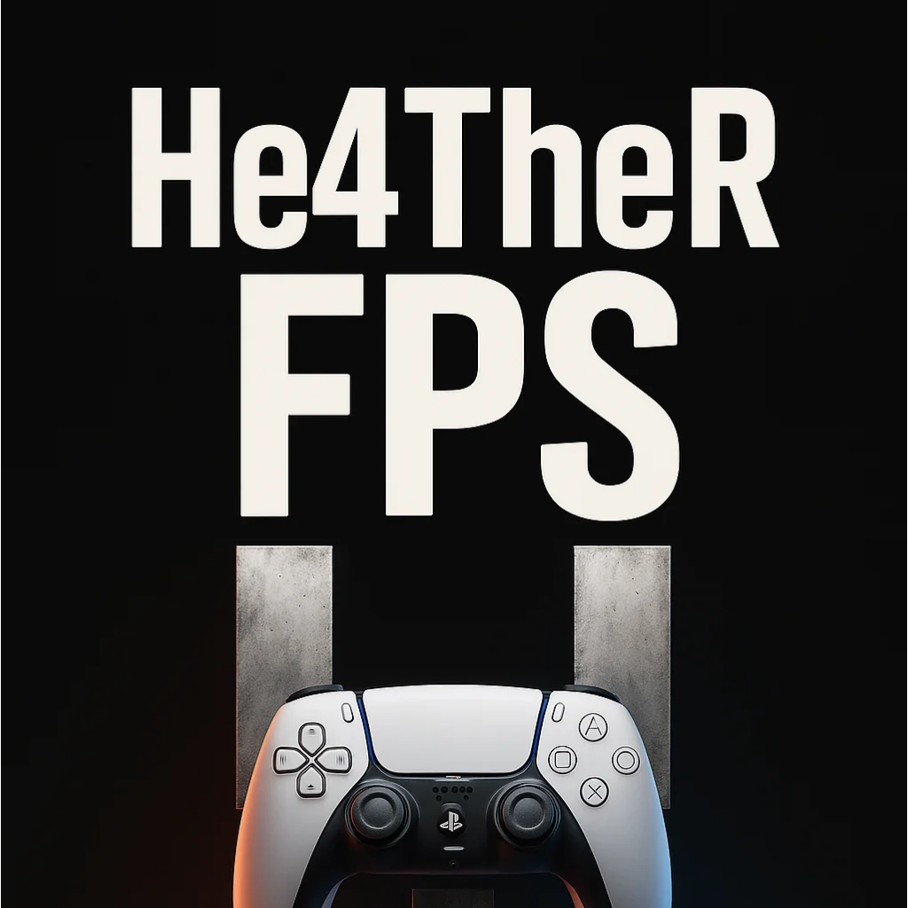

# HE4THER DEV

  

### I build applications for the gaming world.

Player tools, utilities, desktop software — from idea to release.

**C# · Python · C++**

---

### What I do

I create apps around gaming: comfort tools, setup helpers, automation, and interfaces that make players' daily workflow easier.

No fluff. Software that installs and just works.

---

### Approach

| | |
|---|---|
| **Build** | Ready-to-use applications |
| **Ship** | Clean, tested releases |
| **Craft** | Polished UI and packaging |

---

### Stack

`C#` `Python` `C++` `Windows` `Open Source`

---

  <b>HE4THER DEV</b> 
  <i>Apps for players. Simple. Effective.</i>

