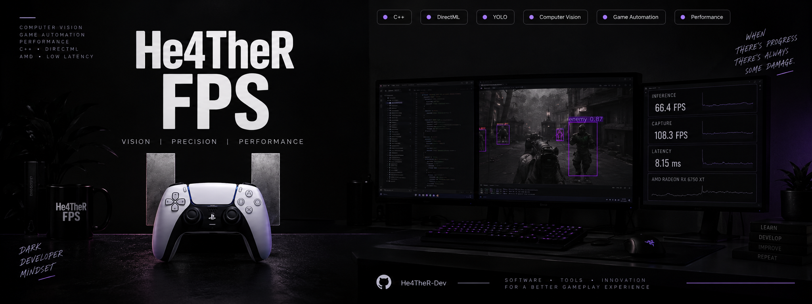
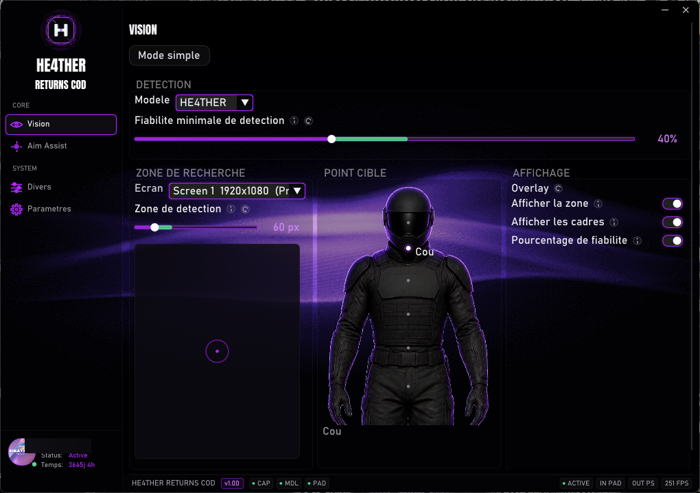
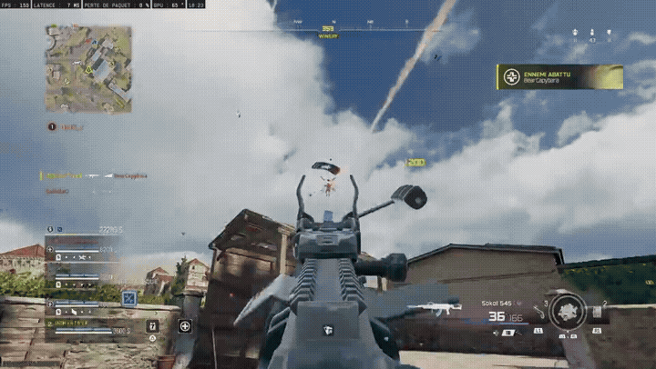

# HE4THER DEV

  

### I build applications for the gaming world.

Player tools, utilities, desktop software — from idea to release.

**C# · Python · C++**

---

### What I do

I create apps around gaming: comfort tools, setup helpers, automation, and interfaces that make players' daily workflow easier.

No fluff. Software that installs and just works.

---

### Approach

| | |
|---|---|
| **Build** | Ready-to-use applications |
| **Ship** | Clean, tested releases |
| **Craft** | Polished UI and packaging |

---

### Stack

`C#` `Python` `C++` `Windows` `Open Source`

---

### Software examples

Desktop tooling I build — UI, real-time systems, and player-facing apps.

  

**HE4THER Returns** — Windows desktop app with modular panels for real-time vision: model selection, detection confidence, search zone, target points, and on-screen overlays. Built for low-latency capture and inference workflows.

---

### Stream — Starting scene

OBS starting scene from the HE4THER pack — autoplaying gameplay preview (full 30s MP4 on click).

  

---

  <b>HE4THER DEV</b> 
  <i>Apps for players. Simple. Effective.</i>

