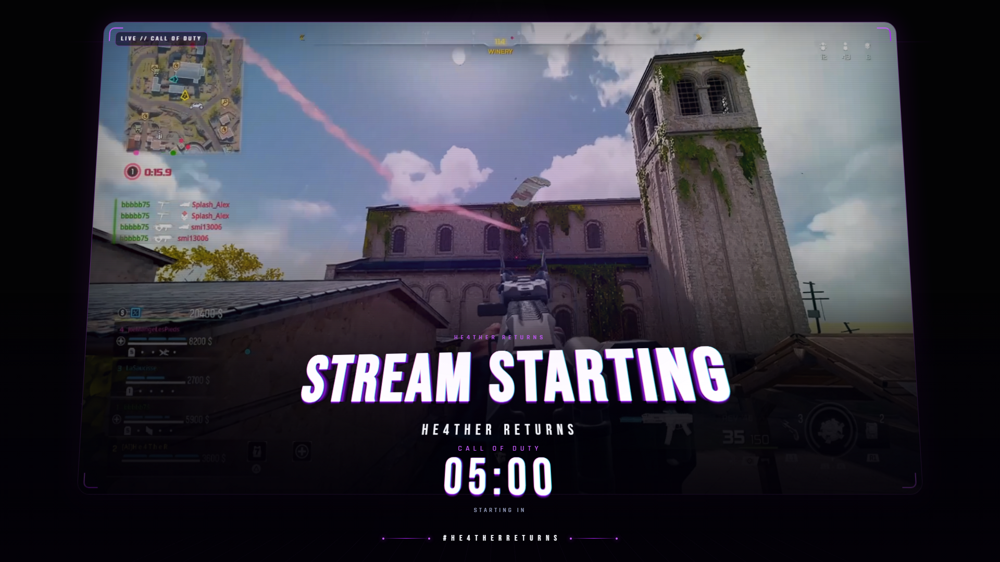

# HE4THER DEV

  

### I build applications for the gaming world.

Player tools, utilities, desktop software — from idea to release.

**C# · Python · C++**

---

### Library

A showcase of HE4THER apps and stream work — UI shots and live scene previews.

<table>
  <tr>
    <td width="50%" align="center" valign="top">
      
       
      <b>Stream — Starting scene</b> 
      OBS overlay · STREAM STARTING · countdown
    </td>
    <td width="50%" align="center" valign="top">
      
       
      <b>HE4THER Returns</b> 
      Real-time vision desktop app
    </td>
  </tr>
  <tr>
    <td width="50%" align="center" valign="top">
      
       
      <b><a href="https://github.com/He4TheR-Dev/HE4THER-DS4-Windows">HE4THER DS4 Windows</a></b> 
      DualShock / DualSense on Windows
    </td>
    <td width="50%" align="center" valign="top">
      
       
      <b><a href="https://github.com/He4TheR-Dev/HE4THER-DS4-Windows-HS">HE4THER DS4 Windows HS</a></b> 
      Advanced macros · FPS tools
    </td>
  </tr>
  <tr>
    <td width="50%" align="center" valign="top">
      
       
      <b><a href="https://github.com/He4TheR-Dev/RedM-RP-Utility">RedM RP Utility</a></b> 
      TeamSpeak · SaltyChat · cache cleanup
    </td>
    <td width="50%" align="center" valign="top">
      
       
      <b>OBS pack — still</b> 
      Branded stream starting frame
    </td>
  </tr>
</table>

---

### Stack

`C#` `Python` `C++` `Windows` `Open Source`

---

### Approach

| | |
|---|---|
| **Build** | Ready-to-use applications |
| **Ship** | Clean, tested releases |
| **Craft** | Polished UI and packaging |

---

  <b>HE4THER DEV</b> 
  <i>Apps for players. Simple. Effective.</i>

