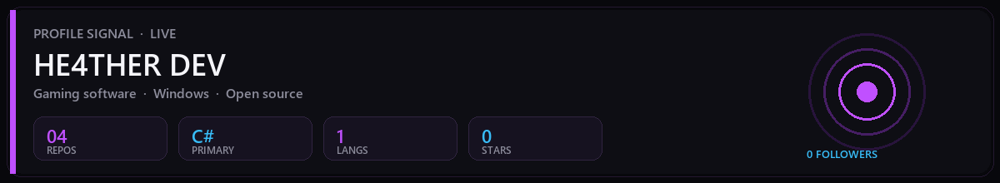
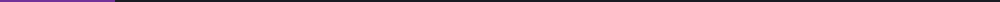
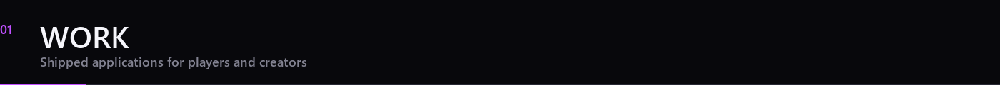
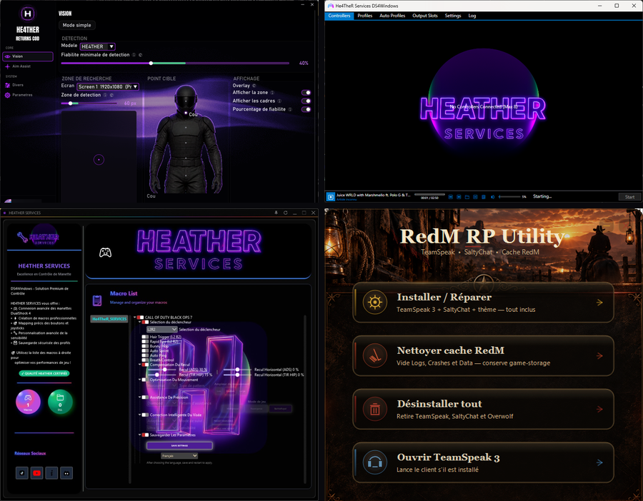
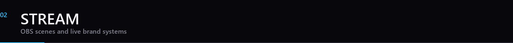



  

<h1 align="center">HE4THER DEV</h1>

  I build gaming software for Windows — tools players install and use every day. 
  Desktop apps · controller systems · stream tooling

  

  

  
  
  

  Stats refresh automatically when your GitHub activity changes

  

  

  <a href="https://github.com/He4TheR-Dev/HE4THER-DS4-Windows">DS4 Windows</a>
  ·
  <a href="https://github.com/He4TheR-Dev/HE4THER-DS4-Windows-HS">DS4 Windows HS</a>
  ·
  <a href="https://github.com/He4TheR-Dev/RedM-RP-Utility">RedM RP Utility</a>

  

  

  OBS starting scene — branded overlay, countdown, live reel

  <strong>HE4THER DEV</strong> 
  Apps for players. Simple. Effective.

