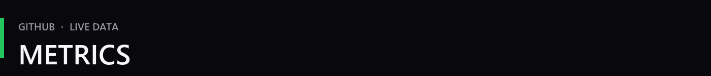
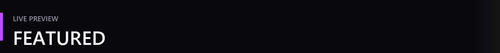
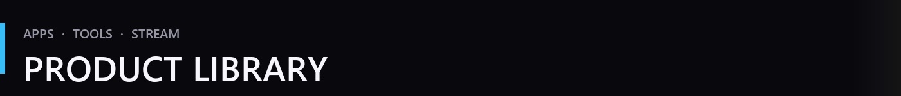



  

  <strong>HE4THER DEV</strong> 
  Gaming software · Windows tools · Stream systems

  

 

  

  
  

  

  

  
  

  

 

  

  

  <b>STREAM STARTING</b> — OBS scene · live overlay · countdown

 

  

  
  

  
  

  
    <a href="https://github.com/He4TheR-Dev/HE4THER-DS4-Windows">DS4 Windows</a>
    &nbsp;·&nbsp;
    <a href="https://github.com/He4TheR-Dev/HE4THER-DS4-Windows-HS">DS4 Windows HS</a>
    &nbsp;·&nbsp;
    <a href="https://github.com/He4TheR-Dev/RedM-RP-Utility">RedM RP Utility</a>
  

 

  

  <b>HE4THER DEV</b> 
  <i>Apps for players. Simple. Effective.</i>

